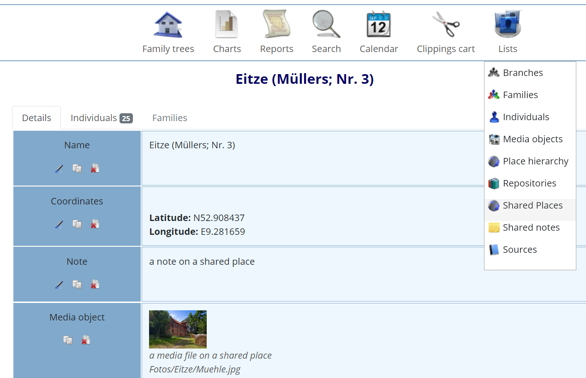
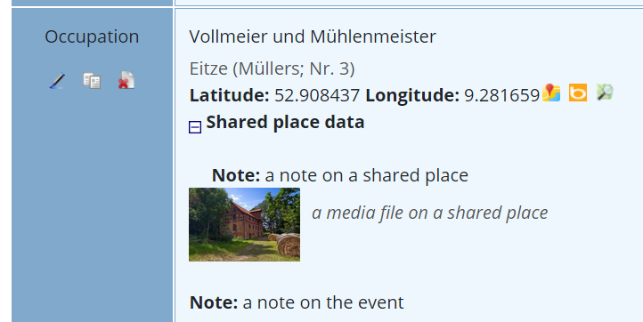
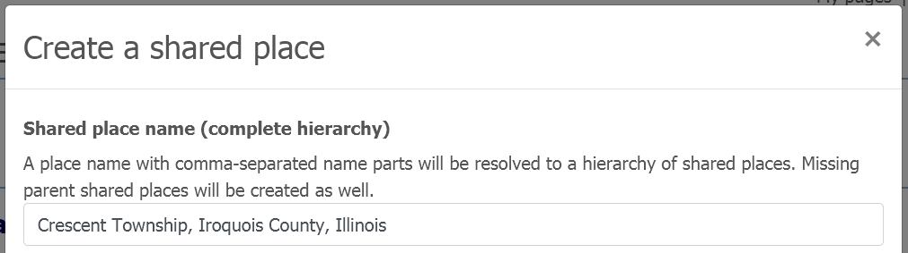

# ⚶ Vesta Shared Places (Webtrees 2 Custom Module)

This [webtrees](https://www.webtrees.net/) custom module supports shared places as level 0 GEDCOM objects, on the basis of the GEDCOM-L Addendum to the GEDCOM 5.5.1 specification. It displays data via the extended 'Facts and Events' tab, enhancing places with data obtained from the respective shared place.
The project’s website is [cissee.de](https://cissee.de).

This is a webtrees 2.x module - It cannot be used with webtrees 1.x. For its webtrees 1.x counterpart, see [here](https://github.com/ric2016/shared_places).

## Overview: Location data management

See [here](https://github.com/vesta-webtrees-2-custom-modules/vesta_common/blob/master/docs/LocationData.md) for an overview of location data management in webtrees, including different use cases for shared places.

## Contents

* [Features](#features)
* [Gedcom-L Addendum](#gedcom)
* [Download](#download)
* [Installation](#installation)
* [License](#license)

### Features<a name="features"/>

* Shared places are handled as level 0 _LOC records, containing coordinates, notes, and media objects.
* In combination with the Gov4Webtrees module, this module may also be used to manage GOV ids within GEDCOM data.
* Shared places may be edited and viewed via an additional entry in the list menu.

* On the (extended) facts and events tab, shared place data is displayed in addition to regular place data.

* All shared place data is fully included in the gedcom exported by webtrees (and may also be imported from other sources supporting _LOC records), on the basis of the GEDCOM-L Addendum.
* Location data is provided to other modules (e.g. for use in maps).

* Shared places may be hierarchical, similar to regular places. Hierarchical relationships between shared places are modelled via explicit links (XREFs to higher-level shared places). This allows to model more complex relationships than via the place hierarchy itself, which uses comma-separated place name parts to indicate the hierarchy. When creating a shared place from a given place name, any missing higher-level shared places are created as well:

* As hierarchical shared places have not been supported by earlier versions of this custom module, you may have to use a data fix in order to convert existing shared places (having comma-separated name parts), as a one-time migration. This will only affect shared place records of the respective GEDCOM file.

* The Vesta Places and Pedigree Map module provides an extended place hierarchy list, which may be filtered to shared places. This is useful e.g. to show subordinate shared places.

### Gedcom-L Addendum<a name="gedcom"/>

The Gedcom-L Addendum to the GEDCOM 5.5.1 specification is available [here](https://genealogy.net/GEDCOM/). It defines the following structure for top-level place records:

~~~~
LOCATION_RECORD:= 
0 @<XREF:_LOC>@ _LOC {1:1} 
1 NAME <PLACE_NAME> {1:M} 
2 DATE <DATE_VALUE> {0:1} 
2 ABBR <ABBREVIATION_OF_NAME> {0:M} 
3 TYPE <TYPE_OF_ABBREVIATION> {0:1} 
2 LANG <LANGUAGE_ID> {0:1} 
2 <<SOURCE_CITATION>> {0:M} 
1 TYPE <TYPE_OF_LOCATION> {0:M} 
2 _GOVTYPE <GOVID_OF_TYPE> {0:1} 
2 DATE <DATE_VALUE> {0:1} 
2 <<SOURCE_CITATION>> {0:M} 
1 _POST <POSTAL_CODE> {0:M} 
2 DATE <DATE_VALUE> {0:1} 
2 <<SOURCE_CITATION>> {0:M} 
1 _GOV <GOV_IDENTIFIER> {0:1} 
1 MAP {0:1} 
2 LATI <PLACE_LATITUDE> {1:1} 
2 LONG <PLACE_LONGITUDE> {1:1} 
1 _MAIDENHEAD <MAIDENHEAD_LOCATOR> {0:1} 
1 RELI <DENOMINATION> {0:1} 
1 EVEN [<EVENT_DESCRIPTOR>|<NULL>] {0:M} 
2 <<EVENT_DETAIL>> {0:1} 
1 _LOC @<XREF:_LOC>@ {0:M} 
2 TYPE <HIERARCHICAL_RELATIONSHIP> {1:1} 
2 DATE <DATE_VALUE> {0:1} 
2 <<SOURCE_CITATION>> {0:M} 
1 _DMGD <DEMOGRAPHICAL_DATA> {0:M} 
2 DATE <DATE_VALUE> {0:1} 
2 <<SOURCE_CITATION>> {0:M} 
2 TYPE <TYPE_OF_DEMOGRAPICAL_DATA> {1:1} 
1 _AIDN <ADMINISTRATIVE_IDENTIFIER> {0:M} 
2 DATE <DATE_VALUE> {0:1} 
2 <<SOURCE_CITATION>> {0:M} 
2 TYPE <TYPE_OF_ADMINISTRATIVE_IDENTIFIER> {1:1} 
1 <<MULTIMEDIA_LINK>> {0:M} 
1 <<NOTE_STRUCTURE>> {0:M} 
1 <<SOURCE_CITATION>> {0:M} 
1 <<CHANGE_DATE>> {0:1}
~~~~

### Download<a name="download"/>

* Current version: 2.1.6.0.0
* Based on and tested with webtrees 2.1.6. Requires webtrees 2.1.4 or later.
* Requires the ⚶ Vesta Common module ('vesta_common').
* Displays data via the ⚶ Vesta Facts and events module ('vesta_personal_facts'). 
* Provides location data to other custom modules.
* Download the zip file, which includes all Vesta modules, [here](https://cissee.de/vesta.latest.zip).
* Support, suggestions, feature requests: <ric@richard-cissee.de>
* Issues also via <https://github.com/vesta-webtrees-2-custom-modules/vesta_shared_places/issues>
* Translations may be contributed via weblate: <https://hosted.weblate.org/projects/vesta-webtrees-custom-modules/>

### Installation<a name="installation"/>

* Unzip the files and copy the contents of the modules_v4 folder to the respective folder of your webtrees installation. All related modules are included in the zip file. It's safe to overwrite the respective directories if they already exist (they are bundled with other custom modules as well), as long as other custom models using these dependencies are also upgraded to their respective latest versions.
* Enable the extended 'Facts and Events' module via Control Panel -> Modules -> All modules -> ⚶ Facts and Events.
* Enable the main module via Control Panel -> Modules -> All modules -> ⚶ Shared Places. After that, you may configure some options.
* Configure the visibility of the old and the extended 'Facts and Events' tab via Control Panel -> Modules -> Tabs (usually, you'll want to use only one of them. You may just disable the oringinal 'Facts and Events' module altogether).
* Configure the visibility of the old 'Locations' and the extended 'Shared places' list via Control Panel -> Modules -> Lists (usually, you'll want to use only one of them. You may just disable the original 'Locations' module altogether).

### License<a name="license"/>

* **vesta_shared_places: a webtrees custom module**
* Copyright (C) 2019 – 2022 Richard Cissée
* Derived from **webtrees** - Copyright 2022 webtrees development team.
* French translations provided by Pierre Dousselin.
* Dutch translations provided by TheDutchJewel.
* Slovak translations provided by Ladislav Rosival.
* Czech translations provided by Josef Prause.
* Further translations contributed via weblate.

This program is free software: you can redistribute it and/or modify
it under the terms of the GNU General Public License as published by
the Free Software Foundation, either version 3 of the License, or
(at your option) any later version.

This program is distributed in the hope that it will be useful,
but WITHOUT ANY WARRANTY; without even the implied warranty of
MERCHANTABILITY or FITNESS FOR A PARTICULAR PURPOSE. See the
GNU General Public License for more details.

You should have received a copy of the GNU General Public License
along with this program. If not, see <http://www.gnu.org/licenses/>.
